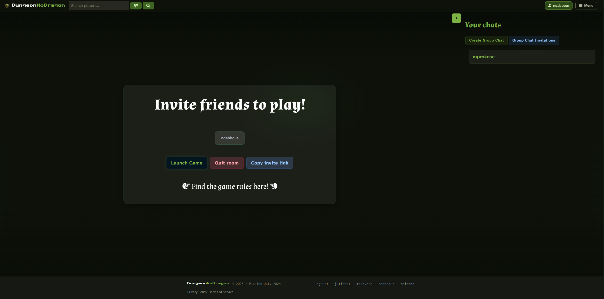
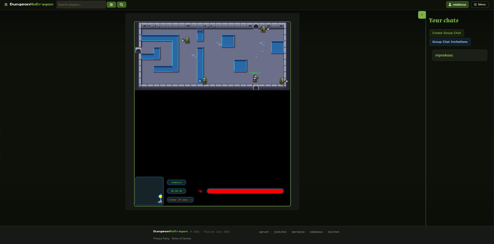
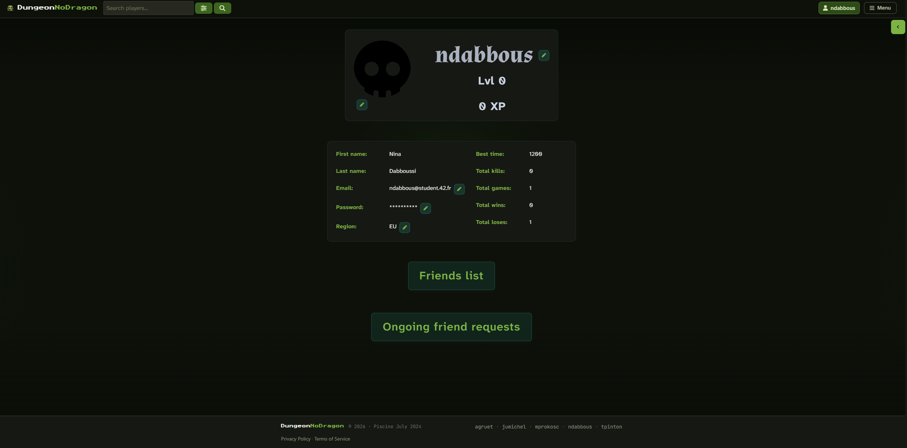

<div align="center">

# 👉 Play directly here : [DungeonNoDragon.xyz](https://dungeonnodragon.xyz) 👈

# 🐉 DungeonNoDragon — Multiplayer Web Roguelike

> **A full-stack web application combining a real-time multiplayer game, social features, and a high-performance C++ engine compiled to WebAssembly.**
> Built as part of the 42 curriculum by agruet, ndabbous, mprokosc, tpinton and jumichel.

</div>

---

## ⚙️ Installation & Setup

### Prerequisites

* Git
* Linux
* Make
* Docker
* Docker Compose v2

### Environment Setup

Fill in the provided `.env` file located in `./docker/.env`.

Create and fill the required secret files:

```
./docker/secrets/google_secret.txt        Google OAuth secret key
./docker/secrets/secret_42.txt            42 OAuth secret key
./docker/secrets/db_password.txt          PostgreSQL user password
./docker/secrets/pgadmin_password.txt     pgAdmin account password
./docker/secrets/smtp_secret.txt          Gmail account secret key
```

### ▶️ Run the project

```bash
git clone https://github.com/Anicet78/DungeonNoDragon.git
cd DungeonNoDragon
make
```
---

## 🚀 What is at the core of DungeonNoDragon ?

DungeonNoDragon is a **complete ecosystem** where modern web technologies meet **low-level game programming**:

* ⚡ Real-time multiplayer dungeon crawler
* 🌐 Full-stack TypeScript architecture
* 🎮 C++ game engine running in the browser (WebAssembly)
* 💬 Advanced chat & social system
* 🐳 Fully containerized with Docker

We wanted a combination of both **software engineering rigor** and **system-level understanding**, making it relevant for backend, full-stack, or systems-oriented roles.

## 🎮 Game Overview

### 🕹️ What is DungeonNoDragon?

DungeonNoDragon is a **multiplayer rogue-like dungeon crawler** playable directly in the browser.

Players can:

* Explore procedurally generated dungeons
* Fight monsters in real time
* Play solo or with friends
* Track progression (XP, levels, stats)

The game is fully integrated into a **social platform**, allowing users to:

* Invite friends
* Chat in real time
* Create group chat with an advanced role system (owner, admin, moderator, writer or read-only)
* Create game rooms
* Track performance across sessions

---

## 📸 Game Snapshots

### 🗺️ Home page


### ⚔️ Combat & gameplay



### 🌐 Web interface & social features



---

## 🧠 Technical Highlights

### 🧩 Architecture

```
Frontend (React + TS)
        ↓
Backend API (Fastify + TS)
        ↓
Database (PostgreSQL + Prisma)
        ↓
Game Server (C++)
        ↓
Game Client (C++ + SDL2 → WebAssembly)
```

---

## 🛠️ Tech Stack

### Frontend

* **React +  TypeScript (ESNext) & JSX**
* Vite (build tool)
* Bulma (CSS framework)
* Data fetching:
	* TanStack Query
	* Axios
* Socket.io (real-time)

### Backend / API

* **Node.js + TypeScript (ESNext)**
* API type: REST
* Fastify (high-performance framework)
* Prisma (ORM)
* PostgreSQL
* Swagger (API docs)
* Argon2 (hashing, security)
* Socket.io (WebSocket)

### Game Engine

**Client**
* Language: C++
* Library: SDL2
* Compiler: Emscripten
* Runtime: WebAssembly
* WebSocket: JavaScript

**Server**
* Language: C++
* WebSocket: uWebSockets
* HTTP Client: libcurl

### Database Schema


**The database has been designed to maximize unique information sources, with minimal concessions for query optimization.**

---

## 🔥 Key Features

* 🎮 Multiplayer rogue-like game (PvE)
* 👥 Friends & profile system
* 💬 Advanced chat (private + group + roles)
* 🔍 Search & filtering system
* 🔐 Authentication (including OAuth)
* 📊 Player statistics tracking
* ⚡ Real-time synchronization (WebSockets)

---

## 🧱 Challenges & Solutions

### 1. Running a C++ game inside the browser

**Challenge:**
Bridging C++ (native) with JavaScript (web environment)

**Solution:**

* Compiled the game using **Emscripten → WebAssembly**
* Built custom bindings between JS and C++
* Managed memory across environments

---

### 2. Real-time multiplayer synchronization

**Challenge:**
Keeping all players in sync with minimal latency

**Solution:**

* Tick-based server architecture (~50ms) to keep the server responsive and predictable
* Server‑side authority and reconciliation mechanisms
* Client prediction + smoothing

---

### 3. Full-stack real-time architecture

**Challenge:**
Synchronizing frontend, backend, and game server

**Solution:**

* WebSockets (Socket.io + uWebSockets)
* Event-driven architecture
* Clear separation of responsibilities

---

### 4. Complex database design

**Challenge:**
Handling social features (chat, friends, permissions)

**Solution:**

* Fully normalized PostgreSQL schema
* Prisma ORM for maintainability and security
* Early design + iterative improvements

---

### 5. Team collaboration (5 developers)

**Challenge:**
Working on a large-scale project with tight deadlines

**Solution:**

* Agile-like organization
* Task distribution by domain
* Git workflow with protections
* Notion + Discord for communication

---

## 👥 Team

| Name     | Role                         |
| -------- | -----------------------------|
| agruet   | Tech Lead / Full-stack       |
| ndabbous | Project Manager / Full-stack |
| mprokosc | Game Dev                     |
| tpinton  | Game Dev                     |
| jumichel | Frontend                     |

---

## Resources

* YouTube
	* [Fireship Channel](https://www.youtube.com/@Fireship)
	* [Full backend breakdown video](https://www.youtube.com/watch?v=adOkTjIIDnk)
	* [PostgreSQL full course](https://www.youtube.com/watch?v=zw4s3Ey8ayo)
	* [Socket.io](https://www.youtube.com/watch?v=djMy4QsPWiI)

* Documentation
	* [SDL](https://wiki.libsdl.org/SDL2/CategoryAPIFunction)
	* [Prisma](https://www.prisma.io/docs/orm)
	* [Curl](https://curl.se/libcurl/c/allfuncs.html)
	* [React](https://react.dev/learn)
	* [Vite](https://vite.dev/guide)
	* [Bulma](https://bulma.io)

* Tutorials
	* [Beginning Game Programming](https://lazyfoo.net/tutorials/SDL/index.php)
	* [Creating a simple roguelike](https://www.parallelrealities.co.uk/tutorials/rogue/rogue1.php)
	* [Databases](https://www.prisma.io/dataguide/intro/what-are-databases)
	* [PostgreSQL](https://www.w3schools.com/postgresql/index.php)
	* [Start with react](https://openclassrooms.com/fr/courses/8710331-debutez-avec-react)
	* [Complete react application](https://openclassrooms.com/fr/courses/7150606-creez-une-application-react-complete)

* Assets
	* [Dungeon Gathering](https://snowhex.itch.io/dungeon-gathering)
	* [Basic Forest Tileset](https://schwarnhild.itch.io/basic-forest-tileset-32x32-pixels)
	* [Pixel Art Top Down](https://cainos.itch.io/pixel-art-top-down-basic)
	* [Itch.io](https://itch.io)
	* [Pixilart](https://www.pixilart.com)
	* [Animation generator](https://animista.net)

* AI Usage
	* Provide easy access to documentation and concept explanations
	* Help explain and solve bugs

---

## Credits

**Thanks to Snowhex, Schwarnhild and Cainos for their free textures**

[Snowhex's dungeon textures](https://snowhex.itch.io/dungeon-gathering)
[Schwarnhild's forest textures](https://schwarnhild.itch.io/basic-forest-tileset-32x32-pixels)
[Cainos's grass and stone textures](https://cainos.itch.io/pixel-art-top-down-basic)
